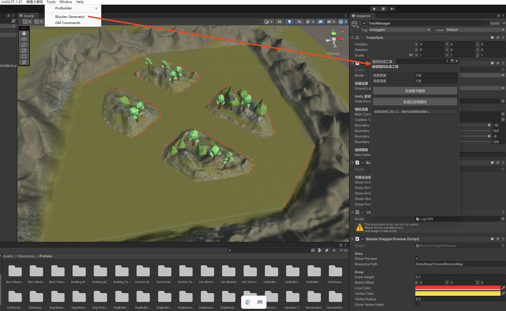
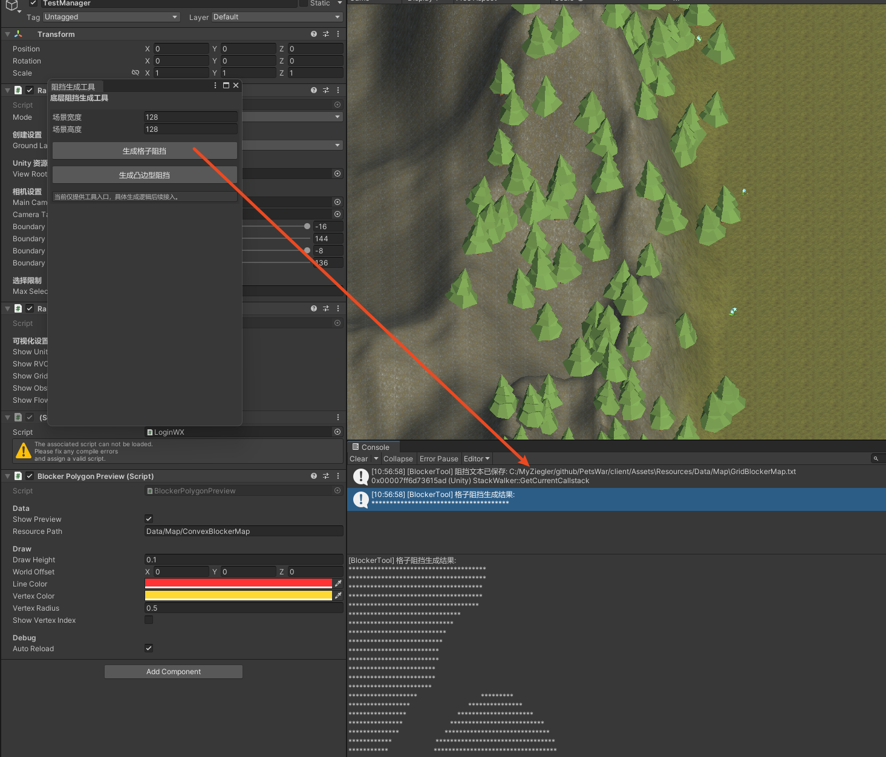
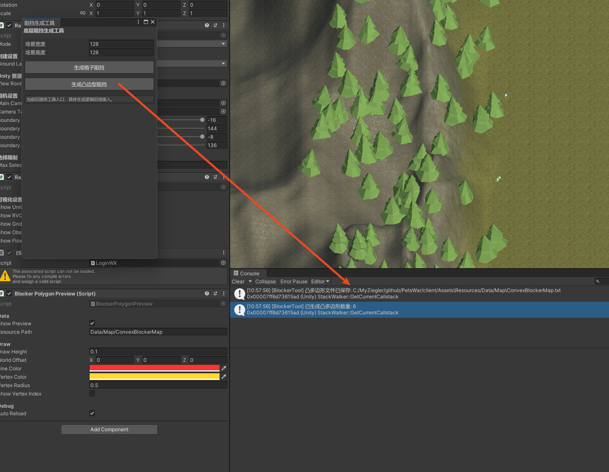
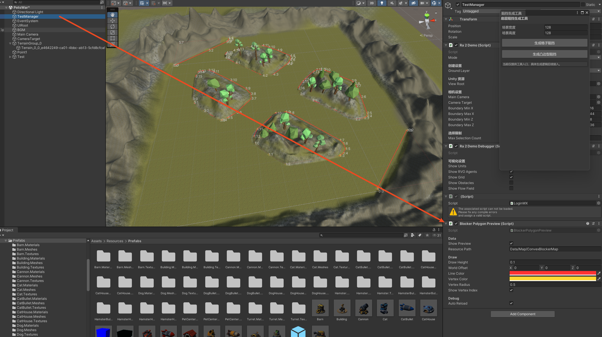
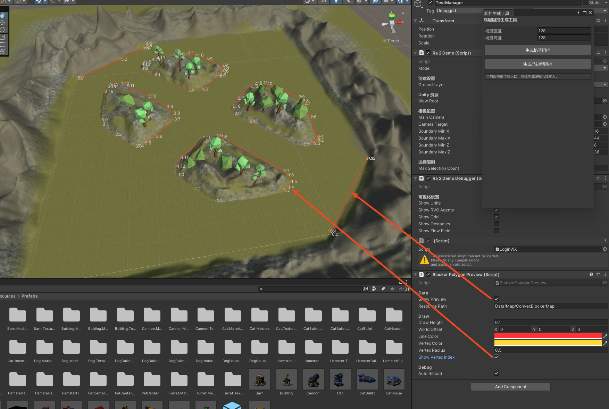

# 阻挡编辑器




## 生成格子阻挡信息文件
- 目录：client/Assets\Resources/Data/Map
- 文件：GridBlockerMap.txt
```
11111111111111111111111111111111111111000000000000000000000000000000000000000000000000000000000000000000000000000000000000000000
11111111111111111111111111111111111111000000000000000000000000000000000000000000000000000000000000000000000000000000000000000000
11111111111111111111111111111111111110000000000000000000000000000000000000000000000000000000000000000000000000000000000000000000
11111111111111111111111111111111111110000000000000000000000000000000000000000000000000000000000000000000000000000000000000000000
11111111111111111111111111111111111100000000000000000000000000000000000000000000000000000000000000000000000000000000000000000000
11111111111111111111111111111110000000000000000000000000000000000000000000000000000000000000000000000000000000000000000000000000
11111111111111111111111111111000000000000000000000000000000000000000000000000000000000000000000000000000000000000000000000000000
11111111111111111111111111100000000000000000000000000000000000000000000000000000000000000000000000000000000000000000000000000000
```


## 生成凸多边形阻挡信息文件
- 目录：client/Assets\Resources/Data/Map
- 文件：ConvexBlockerMap.txt
```
count=6
98,0;128,0;128,26;127,26;98,1
49,31;55,24;62,18;88,18;90,19;92,21;92,24;91,26;70,47;68,48;62,48;51,39;49,35
79,60;85,54;104,37;109,37;111,38;112,40;114,52;115,61;115,63;114,66;100,79;98,80;95,80;92,78;85,72;83,70;79,65
16,66;17,63;23,56;32,48;33,48;36,49;41,52;50,61;50,65;47,70;38,79;27,89;24,91;18,91;17,90;16,86
35,103;42,96;59,80;66,80;77,89;78,90;80,93;81,95;81,98;73,106;67,111;63,114;54,114;44,112;41,111;36,109;35,107
0,100;1,100;23,114;36,123;37,124;38,126;38,128;0,128
```



# 显示凸多边形工具
- 挂载显示脚本:Assets/Scripts/EditorOnly/BlockerPolygonPreview.cs


- 场景显示
