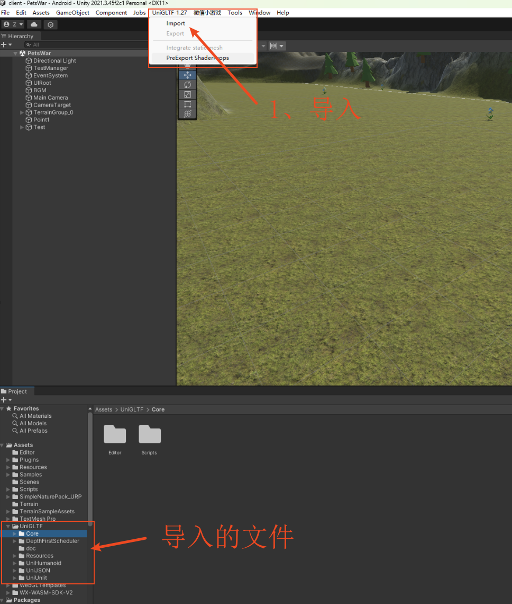
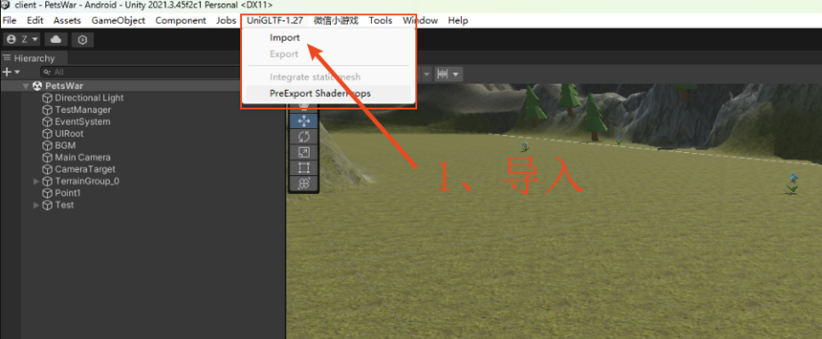
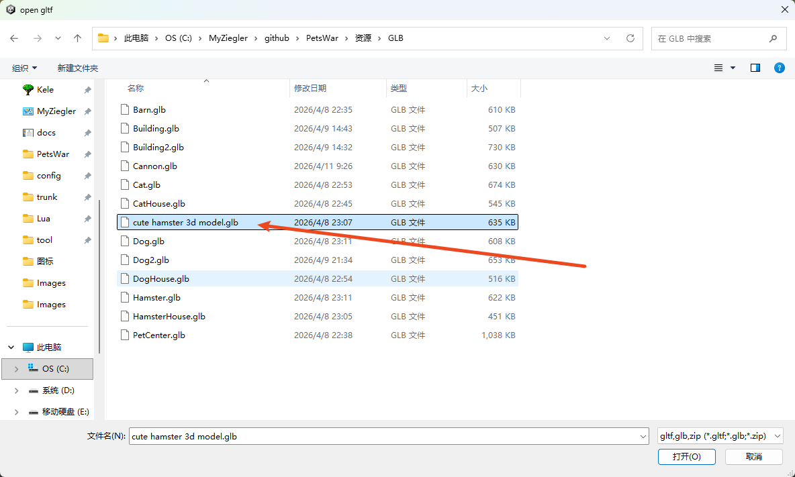
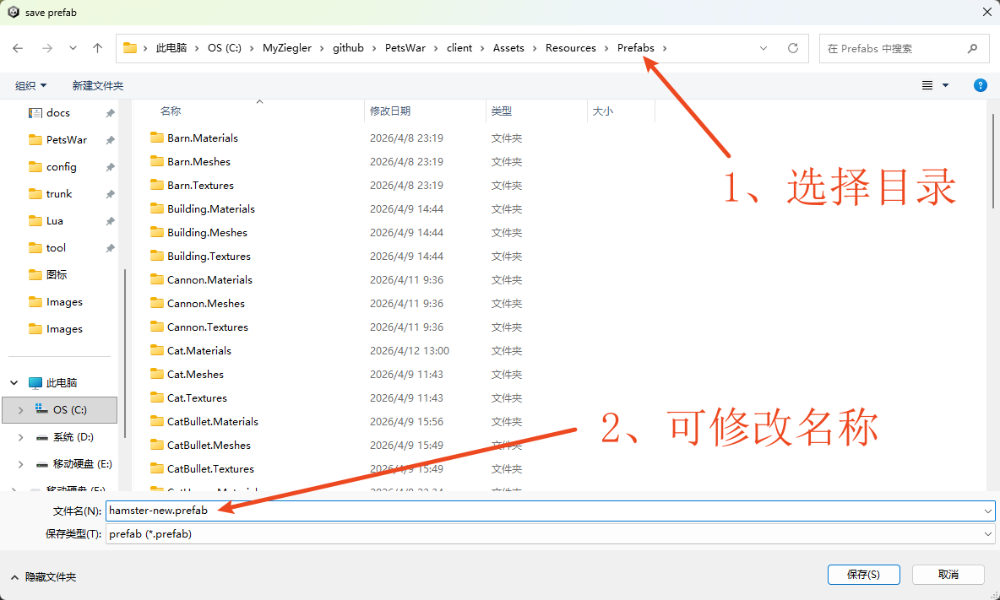
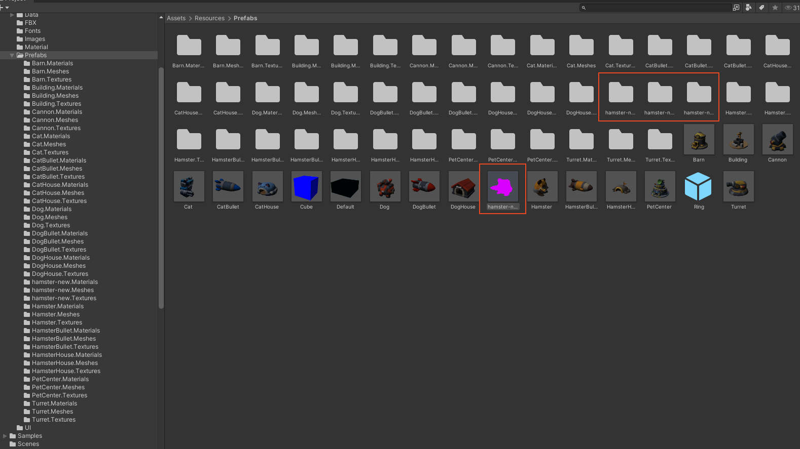
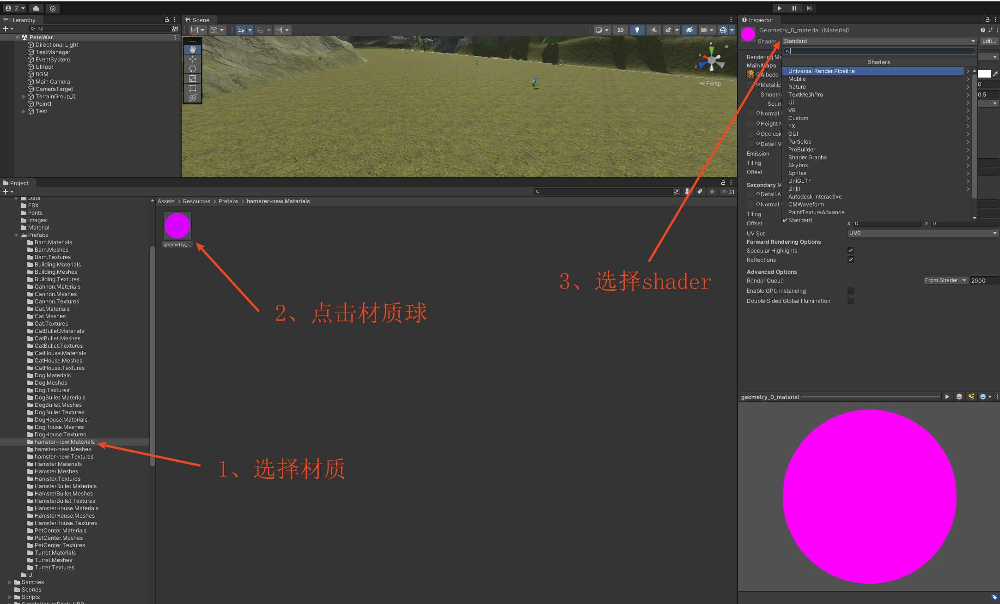
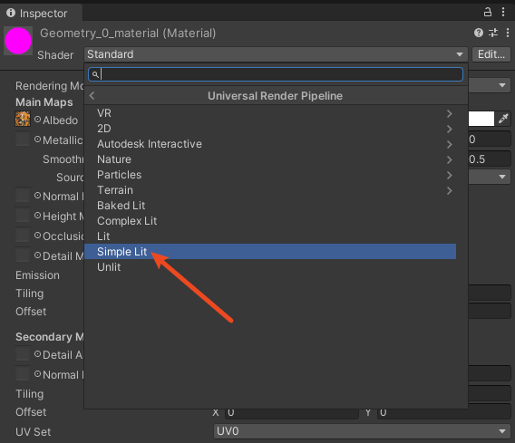
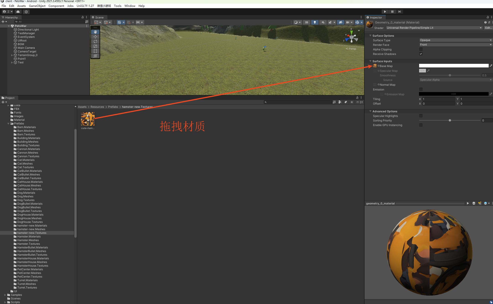
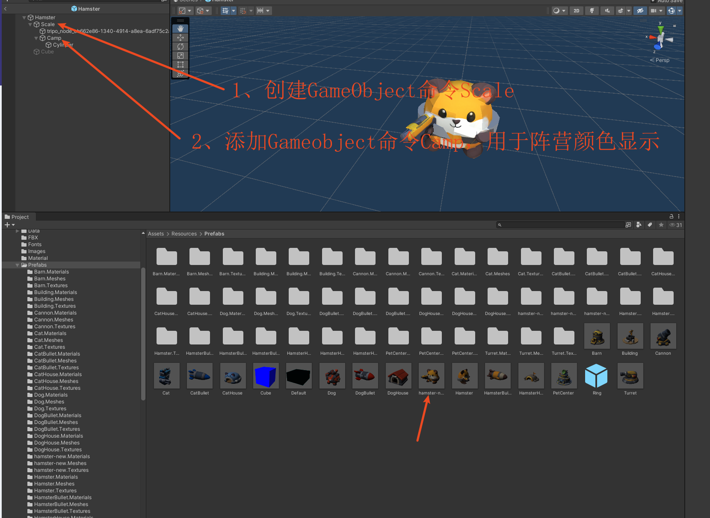
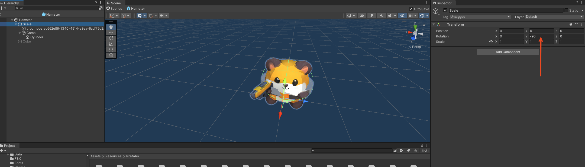

# 导入GBL

## 1、Package Manager安装
- Add package from git URL: 
```
https://github.com/ousttrue/UniGLTF.git?path=/Assets/UniGLTF
```

## 2、安装后菜单栏多出的菜单



# 导入流程

## 1、点击import



## 2、选择glb文件


## 3、选择导入目录和修改prefab名称
- 目录：client\Assets\Resources\Prefabs


- 导入后增加3个文件夹和一个prefab



## 4、修改shader,使用URP


- 选择Simple Lit



## 5、拖拽材质



## 6、修改prefab，以便可以正常使用
- 添加GameObject, 命令Scale，用于缩放调整角度等
- 添加GameObject，命令Camp，用于阵营颜色区分


- 调整角度
