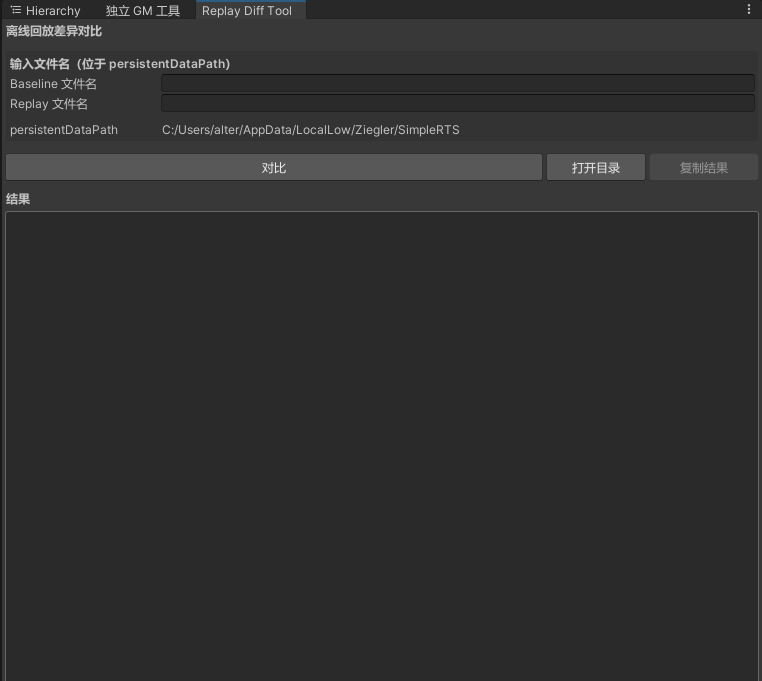
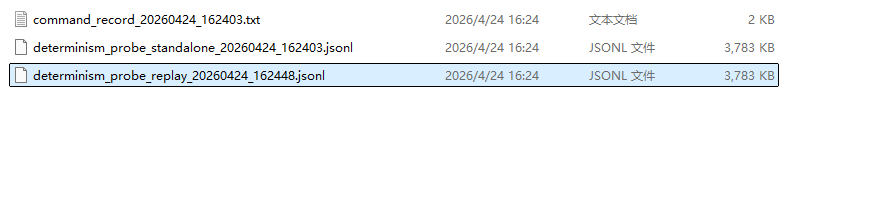
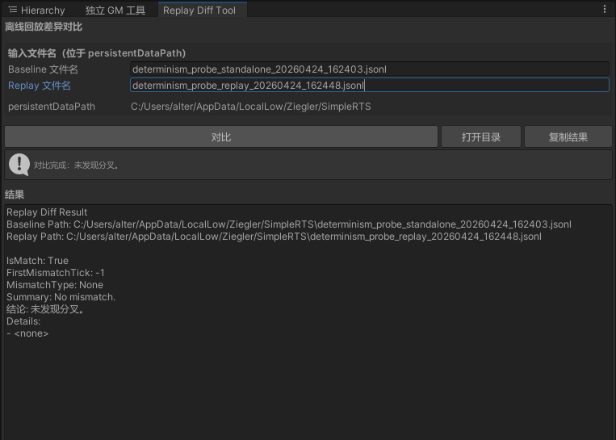
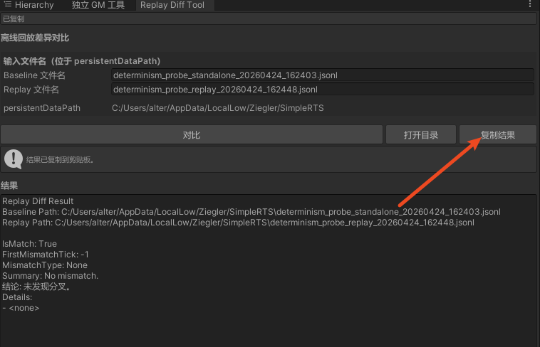

# 回放对比工具

回放对比工具用于对比单机基线与回放运行时生成的确定性探针文件，快速定位第一帧不同步的位置，并辅助判断差异来自命令流、随机状态还是 ECS 状态。



## 1、打开工具

在 Unity 菜单栏打开：

```
Tools/Replay Diff Tool
```

工具窗口名称为 `Replay Diff Tool`，窗口内会显示当前工程的 `Application.persistentDataPath`。

## 2、准备对比文件

对比文件由确定性探针生成，默认位于 `Application.persistentDataPath`。

- 单机基线文件：`determinism_probe_standalone_*.jsonl`
- 回放运行文件：`determinism_probe_replay_*.jsonl`

可以先点击工具窗口中的“打开目录”，进入 `Application.persistentDataPath` 查看已有文件。




## 3、生成本次对比文件

### 3.1 开启确定性探针

在 `DeterminismProbe` 类中确认探针开关处于启动状态：

```csharp
/// <summary>
/// 获取或设置探针是否启用。禁用后即使处于记录状态也不会写入采样结果。
/// </summary>
public bool Enabled { get; set; } = true;
```

### 3.2 启动游戏并记录单机基线

启动游戏进入单机流程，完成需要复现的操作。流程结束后，在 `Application.persistentDataPath` 中确认生成：

- 命令回放文件：`command_record_*.txt`
- 单机探针文件：`determinism_probe_standalone_20260424_162403.jsonl`

其中 `command_record_*.txt` 用于后续启动回放，`determinism_probe_standalone_20260424_162403.jsonl` 作为本次对比的 Baseline 文件。

### 3.3 启动回放并记录回放探针

使用上一步生成的命令回放文件启动回放流程。流程结束后，在 `Application.persistentDataPath` 中确认生成：

- 回放探针文件：`determinism_probe_replay_20260424_162448.jsonl`

该文件作为本次对比的 Replay 文件。

## 4、输入文件名

在工具窗口中填写两个文件名：

- `Baseline 文件名`：填写单机基线 jsonl 文件名
- `Replay 文件名`：填写回放运行 jsonl 文件名

这里只填写文件名，不填写完整路径。工具会自动拼接 `Application.persistentDataPath` 并校验文件是否存在。

本次示例填写：

- `Baseline 文件名`：`determinism_probe_standalone_20260424_162403.jsonl`
- `Replay 文件名`：`determinism_probe_replay_20260424_162448.jsonl`

## 5、执行对比

点击“对比”按钮后，工具会调用 `ReplayDiffTool.CompareFiles` 读取两份 jsonl 文件并输出对比结果。




如果没有发现分叉，状态会显示：

```
对比完成：未发现分叉。
```

如果发现分叉，状态会显示：

```
对比完成：发现分叉，请查看详情。
```

## 6、查看结果

结果区域会输出以下字段：

- `IsMatch`：两份探针文件是否完全匹配
- `FirstMismatchTick`：第一帧不同步的逻辑帧
- `MismatchType`：不同步类型
- `Summary`：差异摘要
- `Details`：详细差异字段

重点优先查看 `FirstMismatchTick` 与 `MismatchType`。只修复第一帧分叉相关逻辑，修完后重新生成基线与回放探针文件再对比。

## 7、差异类型说明

### CommandMismatch

命令流不同步。优先检查：

- 当前帧命令数量是否一致
- 命令类型序列是否一致
- 命令执行帧是否被覆盖或回填错误

### RandomMismatch

随机状态不同步。优先检查：

- 是否存在非确定性随机调用路径
- 是否在逻辑帧外调用了影响全局随机状态的逻辑
- 是否存在单机与回放条件分支不一致

### StateMismatch

命令与随机状态一致，但 ECS 状态不同步。优先检查：

- `Details` 中第一批实体组件字段差异
- 差异实体是否与该帧命令、移动、攻击、生产等逻辑相关
- fixed-point raw 值是否从第一帧分叉处开始偏移

## 8、复制结果

点击“复制结果”可以把完整结果复制到剪贴板，方便粘贴到问题记录或提交给其他人排查。




复制内容包含：

- Baseline 绝对路径
- Replay 绝对路径
- 匹配结论
- 第一帧不同步信息
- 详细差异列表

## 9、常见问题

### 为什么输入文件名后提示文件不存在？

工具只会在 `Application.persistentDataPath` 下查找文件。请先点击“打开目录”，确认文件确实在该目录中，并且输入的是完整文件名。

### 应该用哪两个文件对比？

通常使用同一局命令对应的两份探针文件：

- 单机生成的 `determinism_probe_standalone_*.jsonl`
- 回放同一份命令生成的 `determinism_probe_replay_*.jsonl`

### 发现不同步后先看哪里？

先看 `FirstMismatchTick`，再看 `MismatchType`。不要先分析后续大量差异，后续差异通常是第一帧分叉后的连锁结果。
