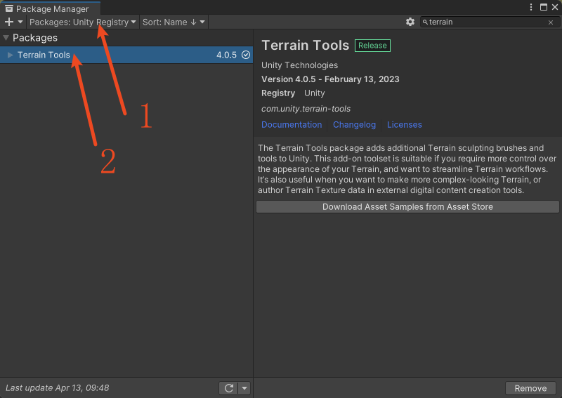
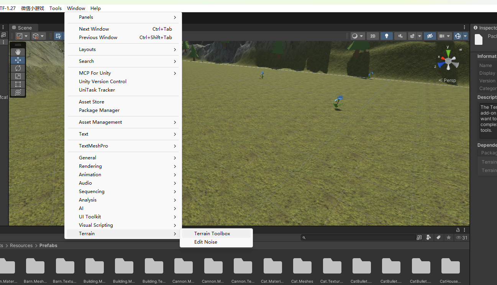
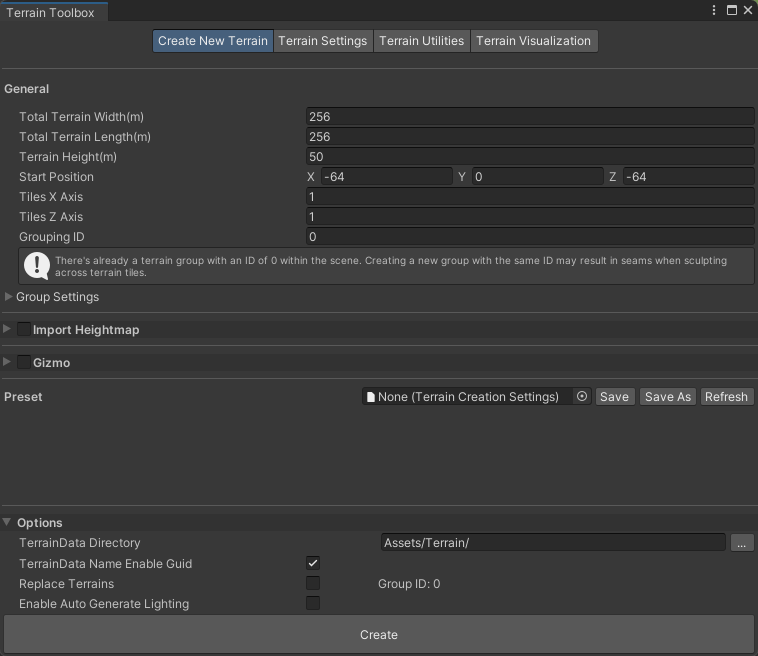
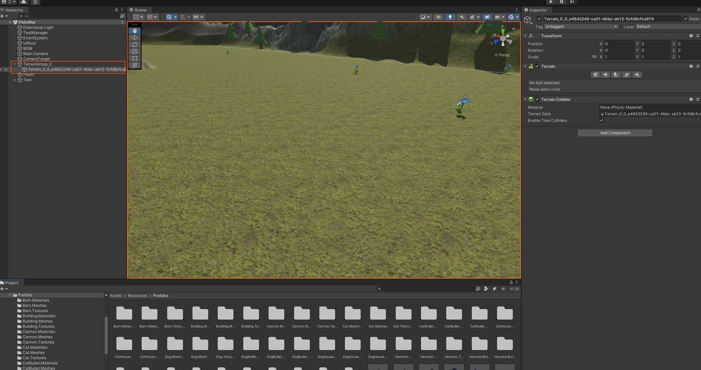
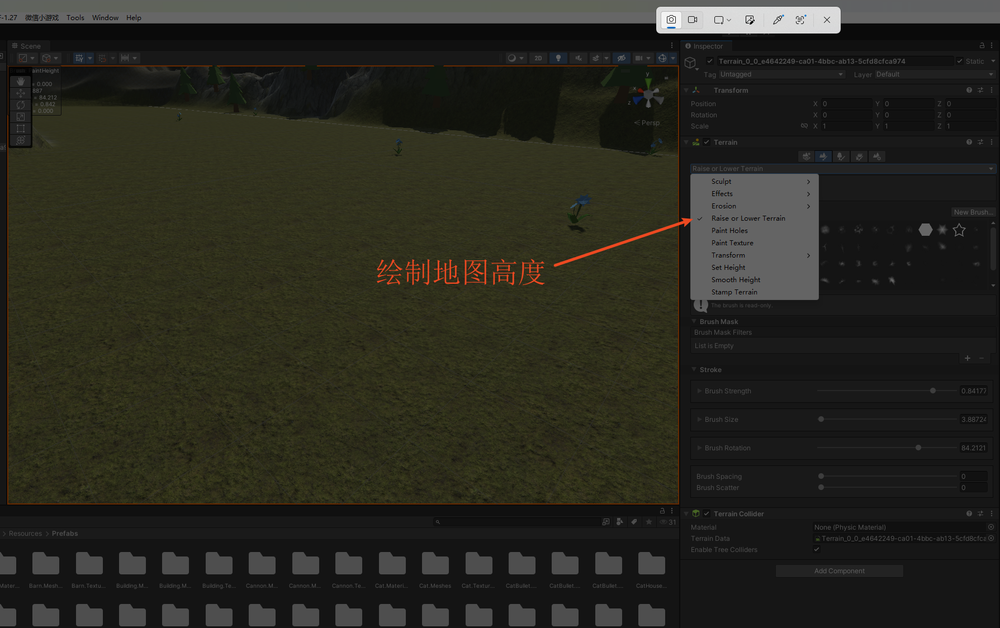
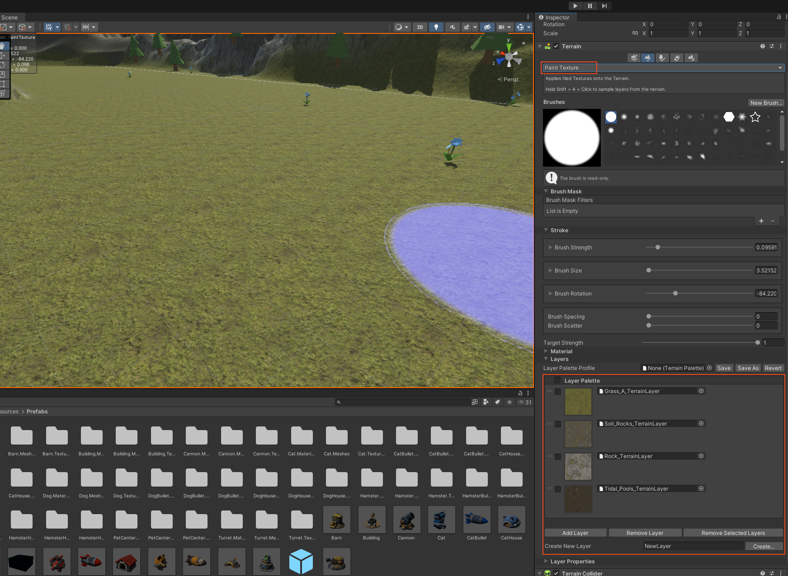
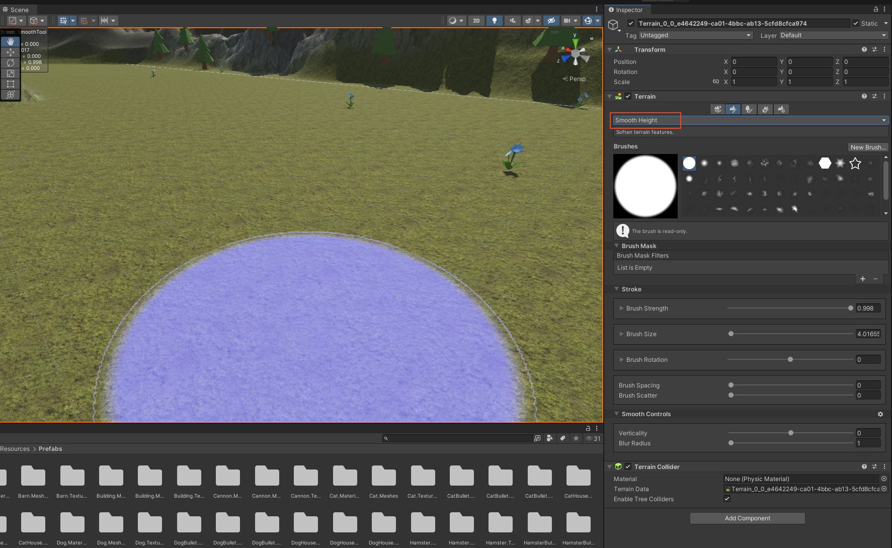
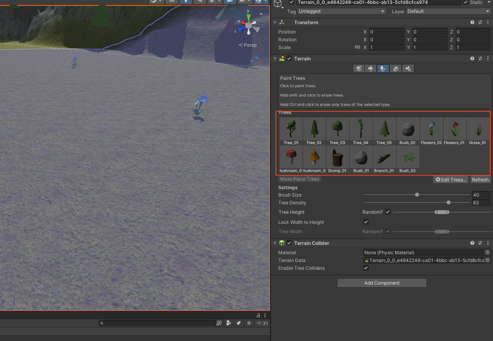

# Terrain Tool

## 1、安装Terrain Tool工具

## 2、打开terrain-toolbox

## 3、创建地图

- 创建后的地图

# 地图绘制

## 1、绘制高度

## 2、绘制地表颜色

## 3、平滑工具

## 4、绘制树木、草、石头等

# 参考

## 安装地形工具（Terrain Tools）
- 1、点击 Window > Package Manager 以打开 包管理器（Package Manager）。
- 2、在展开的 包管理器（Package Manager）页面左上角确保 Packages 选项为 Unity Reistry（Unity 注册表）。
- 3、在右上角搜索框输入 Terrian 以搜索插件，在搜索结果中点击唯一的那一项“Terrian Tools”。
- 4、点击右侧 Install 按钮以安装。

## 3D地图资源：
- https://assetstore.unity.com/packages/3d/environments/landscapes/terrain-sample-asset-pack-145808
- https://assetstore.unity.com/packages/3d/environments/landscapes/low-poly-simple-nature-pack-162153
- https://assetstore.unity.com/packages/tools/painting/prefab-painter-2-61331
- https://assetstore.unity.com/packages/vfx/shaders/low-poly-wind-182586

- https://assetstore.unity.com/packages/3d/environments/landscapes/terrain-sample-asset-pack-145808
- https://assetstore.unity.com/packages/2d/textures-materials/nature/realistic-terrain-textures-lite-279940
- https://assetstore.unity.com/packages/2d/textures-materials/nature/terrain-textures-pack-free-139542

## 贴图资产：
- https://polyhaven.com/textures/terrain
- https://ambientcg.com/list
- https://www.sharetextures.com/textures
- https://www.cgbookcase.com/textures?search=&resolution=1&category=Ground&color=any&page=1
